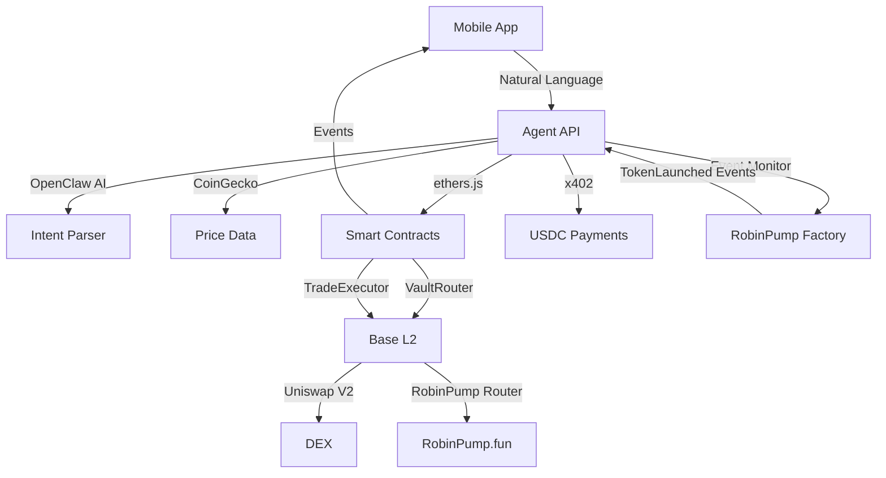

# BluePilot — Hands-Free DeFi Trading on Base

[!IMPORTANT]
**BluePilot: Anti-loss AI + Hands-free trading**

Set your rules once—trade automatically and safely within them. BluePilot combines anti-loss AI, secure smart contracts, and a mobile-first experience for effortless, policy-driven DeFi trading.

BluePilot is a mobile-first, hands-free DeFi trading app that lets users tell an AI what they want to do and have trades executed automatically within safe, on-chain limits.

Instead of constantly watching charts, manually swapping tokens, or reacting emotionally to market moves, users define simple trading rules once — and BluePilot handles the rest.

Powered by secure smart contracts, an AI agent, and a modern mobile app, BluePilot makes trading on Base safer, simpler, and always under your control.

## Architecture



**Key Components:**
- **Agent API**: 7 REST endpoints (simulate, execute, policy, portfolio, price, alerts)
- **OpenClaw AI**: Natural language parsing via Gemini
- **CoinGecko**: Real-time token prices & USD conversions
- **Smart Contracts**: VaultRouter + TradeExecutor on Base Sepolia
- **RobinPump.fun**: Token launch platform integration (pump.fun style on Base)
- **Event Monitor**: Tracks new token launches from RobinPump Factory
- **x402**: Instant USDC payments (no API keys)

## Features

* **Hands-Free Trading:** Tell BluePilot what you want in natural language. It prepares and executes trades within your predefined rules.
* **Policy-Based Automation:** Set limits for trade size, slippage, cooldowns, and allowed tokens. Smart contracts enforce them on-chain.
* **Conversational Control:** Adjust strategies, simulate trades, and manage policies through simple chat commands.
* **Mobile-First Experience:** Clean, fast interface with wallet connection, dark mode, and responsive design.
* **On-Chain Auditability:** Every action is transparent and verifiable via Basescan.
* **Security by Design:** Users keep full custody. Transactions require user approval, and enforcement happens at the contract level.

## Packages

* `packages/agent`: AI agent for intent-based, hands-free trading and policy management
* `packages/contracts`: Solidity smart contracts for vaults, trade execution, and risk enforcement
* `packages/mobile`: React Native app for user interface and wallet integration


## Quick Start

### Prerequisites
- Node.js >= 18, pnpm, Android Studio (for TWA), and a supported wallet app.

### Install
```sh
pnpm install
```

### Build & Test
- Agent: `pnpm --filter agent build && pnpm --filter agent test`
- Contracts: `pnpm --filter contracts build && pnpm --filter contracts test`
- Mobile: `pnpm --filter mobile start`

### Deploy Contracts
```sh
cd packages/contracts && pnpm deploy
```

# Start development server
npm run dev

# Run tests
npm test
```

### Mobile App

```bash
cd packages/mobile

# Start Expo dev server
npm start

# Run on Android
npm run android

# Run on iOS
npm run ios

# Run tests
npm test
```

## Smart Contract Addresses

| Contract | Base Sepolia | Base Mainnet |
|----------|--------------|--------------|
| VaultRouter | `0xB17C9849ef7d21C7c771128be7Dd852f7D5298a9` | TBD |
| TradeExecutor | `0x856d02e138f8707cA90346c657A537e8C67475E0` | TBD |

## Environment Variables

Copy `.env.example` to `.env` and fill in the required values:

```bash
cp .env.example .env
```

### Key Variables

- `BASE_RPC_URL` - Base Mainnet RPC
- `BASE_SEPOLIA_RPC_URL` - Base Sepolia RPC
- `PRIVATE_KEY` - Deployment private key
- `WALLETCONNECT_PROJECT_ID` - WalletConnect project ID

## Security & Audit
See [SECURITY.md](SECURITY.md) for details on contract security, responsible disclosure, and audit status.

## Contributing
See [CONTRIBUTING.md](CONTRIBUTING.md) for guidelines.

## License

MIT

