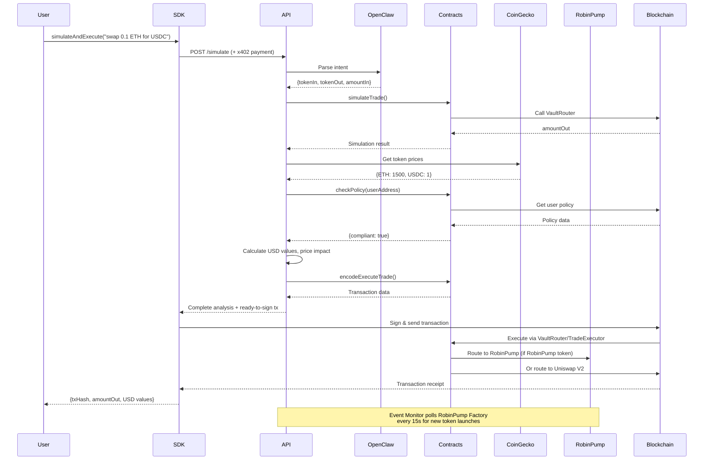

# BluePilot Enhanced API Architecture

## Complete Trade Flow



## API Endpoint Architecture

```
┌─────────────────────────────────────────────────────────────┐
│                     BluePilot API                           │
├─────────────────────────────────────────────────────────────┤
│                                                             │
│  ┌──────────────┐  ┌──────────────┐  ┌──────────────┐    │
│  │   /simulate  │  │   /execute   │  │ /policy/set  │    │
│  │   $0.001     │  │   $0.005     │  │   $0.0005    │    │
│  └──────┬───────┘  └──────┬───────┘  └──────┬───────┘    │
│         │                  │                  │             │
│         └──────────────────┴──────────────────┘             │
│                            │                                │
│         ┌──────────────────┴──────────────────┐            │
│         │                                      │            │
│  ┌──────▼───────┐  ┌──────────────┐  ┌───────▼──────┐    │
│  │  OpenClaw    │  │  CoinGecko   │  │  Contracts   │    │
│  │  (AI Parse)  │  │  (Prices)    │  │  (On-chain)  │    │
│  └──────────────┘  └──────────────┘  └──────────────┘    │
│                                                             │
│  ┌──────────────┐  ┌──────────────┐  ┌──────────────┐    │
│  │ /portfolio   │  │   /price     │  │   /alerts    │    │
│  │   $0.001     │  │    FREE      │  │    FREE      │    │
│  └──────────────┘  └──────────────┘  └──────┬───────┘    │
│                                              │             │
│                                              ▼             │
│                                    ┌──────────────────┐   │
│                                    │  Event Monitor   │   │
│                                    │ (RobinPump.fun)  │   │
│                                    └──────────────────┘   │
│                                                             │
└─────────────────────────────────────────────────────────────┘
                            │
                            │ x402 Payment Layer
                            │
                    ┌───────▼────────┐
                    │  USDC Payment  │
                    │  Verification  │
                    └────────────────┘
```

## Data Flow: /simulate Endpoint

```
User Command: "swap 0.1 ETH for USDC"
        │
        ▼
┌───────────────────┐
│  OpenClaw Parse   │ → {tokenIn: ETH, tokenOut: USDC, amountIn: 0.1}
└────────┬──────────┘
         │
         ▼
┌───────────────────┐
│ Contract Simulate │ → amountOut: 150 USDC
└────────┬──────────┘
         │
         ▼
┌───────────────────┐
│  Get Token Prices │ → ETH: $1500, USDC: $1
└────────┬──────────┘
         │
         ▼
┌───────────────────┐
│ Calculate Metrics │ → USD values, price impact, gas
└────────┬──────────┘
         │
         ▼
┌───────────────────┐
│  Check Policy     │ → compliant: true, violations: []
└────────┬──────────┘
         │
         ▼
┌───────────────────┐
│  Encode TX Data   │ → readyToSign: {to, data, value}
└────────┬──────────┘
         │
         ▼
    Complete Response:
    {
      intent: {...},
      simulation: {
        amountOut: "150000000",
        amountOutUSD: "$150.00",
        priceImpact: "0.15%",
        gasEstimate: "200000",
        route: ["ETH", "USDC"],
        bestDex: "Uniswap V2"
      },
      prices: {...},
      policy: {...},
      readyToSign: {...}
    }
```

## SDK Integration Flow

```
┌─────────────────────────────────────────────────────────┐
│                   Developer's App                       │
└────────────────────┬────────────────────────────────────┘
                     │
                     │ import { BluePilotClient }
                     │
┌────────────────────▼────────────────────────────────────┐
│                  BluePilot SDK                          │
├─────────────────────────────────────────────────────────┤
│                                                         │
│  • simulateAndExecute()  ← One-line trade              │
│  • simulate()            ← Get analysis                │
│  • execute()             ← Prepare transaction         │
│  • getPolicy()           ← Check limits                │
│  • setPolicy()           ← Update limits               │
│  • getPortfolio()        ← Get balances                │
│  • getPrice()            ← Token price                 │
│  • getAlerts()           ← Token launches              │
│                                                         │
│  Handles:                                              │
│  ✓ x402 payment headers                                │
│  ✓ Transaction signing                                 │
│  ✓ Error handling                                      │
│  ✓ Type safety                                         │
│                                                         │
└────────────────────┬────────────────────────────────────┘
                     │
                     │ HTTP + x402 headers
                     │
┌────────────────────▼────────────────────────────────────┐
│                  BluePilot API                          │
│              (Express + ethers.js)                      │
└─────────────────────────────────────────────────────────┘
```

## Policy Enforcement Flow

```
Trade Request
     │
     ▼
┌─────────────────┐
│ Get User Policy │ → maxTradeSize, maxSlippage, cooldown, allowlist
└────────┬────────┘
         │
         ▼
┌─────────────────┐
│ Check Trade Size│ → amountIn <= maxTradeSize?
└────────┬────────┘
         │
         ▼
┌─────────────────┐
│ Check Cooldown  │ → now - lastTrade >= cooldownSeconds?
└────────┬────────┘
         │
         ▼
┌─────────────────┐
│ Check Allowlist │ → tokenOut in allowlist?
└────────┬────────┘
         │
         ▼
    All checks pass?
         │
    ┌────┴────┐
    │         │
   YES       NO
    │         │
    ▼         ▼
Execute   Return violations
Trade     to user
```

## Key Features Visualization

```
┌─────────────────────────────────────────────────────────┐
│              BluePilot API Differentiators              │
├─────────────────────────────────────────────────────────┤
│                                                         │
│  1. Complete Analysis    → USD values, impact, gas     │
│  2. x402 Payments        → No API keys, instant pay    │
│  3. AI-Ready             → Natural language commands   │
│  4. Real-Time Data       → Direct blockchain calls     │
│  5. Custom Policies      → User-defined safety limits  │
│  6. Transparent Pricing  → Clear per-endpoint costs    │
│  7. Great DX             → SDK + docs + examples       │
│                                                         │
└─────────────────────────────────────────────────────────┘
```
